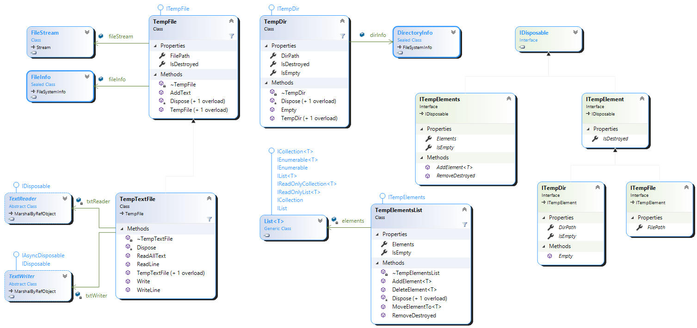
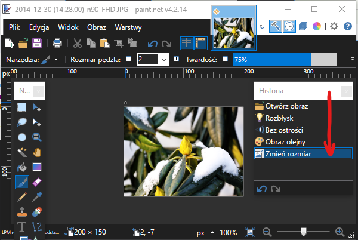

# Zadanie. Implementacja `IDisposable` - obsługa plików i folderów tymczasowych

* Krzysztof Molenda, ver. 0.1/2020

## Cel, zakres

* Cel: stworzenie biblioteki klas wykorzystywanych do obsługi plików i folderów tymczasowych w projektowanych aplikacjach.
* Zakres:
  * wykorzystanie kluczowych klas z `System.IO` (`Stream`, `FileStream`, `StreamWriter`, `StreamReader`, `File`, `Dictionary`, `Path`, ...)
  * poprawne implementowanie interfejsu `IDisposable`
  * użycie instrukcji `using`
  * nabycie umiejętności pracy z wieloma, wzajemnie powiązanymi ze sobą plikami z kodem
* orientacyjny czas realizacji zadań 1-4 - przy sprawnym programowaniu ok. 60 minut
* orientacyjna ilość kodu - ok. 300-400 linii dla implementacji klas

---

## Sformułowanie problemu

Głównym zadaniem jest dostarczenie, w oparciu o podane wytyczne, diagram klas i interfejsów oraz załączony kod, środowiska (_framework_) ułatwiającego poprawne zarządzanie plikami i folderami tymczasowymi (ogólnie, "zewnętrznymi" obiektami tymczasowymi).

Należy zaimplementować odpowiednie klasy.

Pliki i foldery tymczasowe wykorzystywane w aplikacjach tworzone są w trakcie jej działania i usuwane natychmiast, jeśli przestają być potrzebne (w ostateczności, w chwili zakończenia działania aplikacji).

### Diagram klas i interfejsów



### Fragmenty kodu biblioteki - interfejsy

Częściowy kod do zadania zlokalizowany jest w folderze `src/`.

---

### Założenia ogólne

**Nie dokonujemy modyfikacji kodu dostarczonych interfejsów.**

W miarę możliwości odtwarzamy układ klas i ich składników zademonstrowany na diagramie.

Jeśli pewne fragmenty nie zostały jednoznacznie wyjaśnione, samodzielnie podejmujemy decyzje projektowe, starając się osiągnąć główny cel - bezpieczne i poprawne zarządzanie plikami i folderami tymczasowymi.

Uwagi dla implementowanych klas:

* Konstruktor inicjuje (tworzy) wymagany zasób zewnętrzny (plik/katalog).

* Konstruktor bezargumentowy w klasach implementujących `ITempFile` wykorzystuje mechanizmy obsługi plików tymczasowych dostarczonych w bibliotekach C# ([statyczna klasa System.IO.Path](https://docs.microsoft.com/en-us/dotnet/api/system.io.path?view=net-5.0) i metody `Path.GetTempFileName`, `Path.GetTempPath`, `Path.GetRandomFileName` i inne zlokalizowane w tej klasie).

* **Jeśli nie podano ścieżki, plik tymczasowy tworzony jest folderze domyślnym dla plików tymczasowych dla profilu użytkownika** (np. w Windows w `C:\Users\USER\AppData\Local\Temp\tmp35C7.tmp`).

* Konstruktor z argumentem będącym nazwą pliku (wraz z pełną ścieżką) tworzy we wskazanej lokalizacji plik tymczasowy.

* Konstruktor bezargumentowy w klasach implementujących `ITempDir` (a więc katalog tymczasowy) tworzy katalog w folderze domyślnym dla plików tymczasowych dla profilu użytkownika (zwyczajowo w Windows w `C:\Users\USER\AppData\Local\Temp\`); przy generowaniu losowej nazwy można posłużyć się np. [strukturą GUID](https://docs.microsoft.com/en-us/dotnet/api/system.guid).

* Konstruktor z argumentem będącym pełną ścieżką dostępu do folderu tworzy we wskazanej lokalizacji folder tymczasowy.

* W przypadku podania - w konstruktorach wymagających parametru - niepoprawnej ścieżki, zgłaszany jest stosowny wyjątek.

Należy zadbać, aby:

* Przy tworzeniu obiektu reprezentującego plik/katalog tymczasowy **nie został zgłoszony wyjątek po jego fizycznym utworzeniu** - zasób zewnętrzny (niezarządzalny) zostałby utworzony, a obiekt nie będzie istniał - może spowodować to wycieki pamięci lub destabilizację systemu operacyjnego (np. nie zamknięty plik).

* Przy używaniu obiektu reprezentującego plik/katalog tymczasowy nie likwidować dostępu do zasobu - spowoduje to zgłoszenie wyjątku [`ObjectDisposedException`](https://docs.microsoft.com/en-us/dotnet/api/system.objectdisposedexception).

* Po zakończeniu korzystania z pliku/katalogu tymczasowego został on skutecznie i bezwarunkowo usunięty.

Należy obsłużyć ewentualnie pojawiające się wyjątki z `System.IO` <https://docs.microsoft.com/en-us/dotnet/api/system.io.ioexception> (np. w sytuacji tworzenia katalogu podając jego nazwę, a katalog taki we wskazanej lokalizacji już istnieje)

> ⚠️ `ITempElement` można rozszerzyć o innego rodzaju elementy tymczasowe, np. tymczasowy obszar w pamięci RAM (`ITempMemory`) - jest to poza zakresem ćwiczenia.

---

## Etapy realizacji zadania

### Zadanie 1 - rozruch, prosta implementacja `IDisposable` i przesłonięcie `Object.Finalize`

* Utwórz _solution_ z projektem `TempElementsLib` typu _class library_ .Net Standard 2.1
* Dodaj do _solution_ projekt `TempElementsConsoleApp` typu _console application_ .Net Core 3.1
* Korzystając z notatek z wykładu oraz rozdziału z podręcznika _Essential C#_ (rozdział Well formed type → Garbage collection, Resource cleanup) zaprogramuj klasę `TempFile`, implementującą `ITempFile` (w podręczniku oraz notatkach jest praktycznie pełen kod tej klasy).
* Obiekt typu `TempFile` przechowuje informacje o utworzonym (w konstruktorze) pliku tymczasowym oraz zarządza tym zasobem zewnętrznym:
  * plik tymczasowy jest traktowany jako strumień bajtów zmaterializowany na dysku
  * plik tymczasowy otwarty jest w trybie read-write
  * dostęp do fizycznego pliku poprzez pole `public readonly FileStream fileStream`
  * dostęp do informacji o pliku poprzez pole `public readonly FileInfo fileInfo`
  * do pliku można zapisywać tylko ciągi bajtów (np. `byte[]`)
    Aby do pliku binarnego wpisać tekst, możesz skorzystać z metody

    ```csharp
    public void AddText(string value)
    {
        byte[] info = new UTF8Encoding(true).GetBytes(value);
        fileStream.Write(info, 0, info.Length);
        fileStream.Flush();
    }
    ```
  
  * wykorzystując obiekt `TempFile` można zarządzać w dowolny sposób utworzonym plikiem, dysponując referencją `fileStream` (plik jest binarny, może więc reprezentować obraz, tekst, lub cokolwiek innego - po prostu strumień bajtów)
    * w programie konsolowym przetestuj działanie Twojej klasy, zbadaj zachowanie po utworzeniu obiektu (powinien pojawić się plik), po wykonaniu aktualizacji pliku, po opuszczeniu bloku `using` w którym wykorzystywany był plik
    * spróbuj jawnie zwolnić zasób wywołując metodę `Dispose`, a następnie ponownie odwołać się do tego pliku
    * spróbuj napisać kod wykorzystujący zasób, ale bez użycia instrukcji `using` - wykorzystaj `try-catch` i obsłuż stosowne wyjątki
    * sprawdź, jak działa instrukcja `using` w wersji C#8
  
## Zadanie 2 - implementacja udogodnień, klasa `TempTxtFile`

Rozszerzasz klasę `TempFile` (w sensie formalnym - dziedziczenie), a raczej zawężasz jej funkcjonalność do operowania na plikach tylko tekstowych. Celem jest ułatwienie obsługi tymczasowych plików tekstowych, poprzez udostępnienie metod takich jak `Write()` czy `ReadAllText()` bezpośrednio z poziomu klasy `TempFile`.

Skorzystasz ze strumieni "opakowujących": `StreamReader` oraz `StreamWriter`.

Pamiętaj o właściwym zamknięciu wszystkich strumieni przy wywołaniu metody `Dispose`.

Po wykonaniu zapisu do tekstowego strumienia plikowego pamiętaj o opróżnieniu buforów (`Flush`).

Dodaj metody operujące na strumieniach: `ReadLine()`, `ReadAllText()`, `Write()`, `WriteLine()`, ... .

Przetestuj działanie w aplikacji konsolowej.

## Zadanie 3 - klasa `TempDir`

Postępując w podobny sposób jak w zadaniu 1, utwórz klasę `TempDir` implementującą interfejs `ITempDir` i przetestuj poprawność jej działania.

## Zadanie 4 - kolekcja elementów tymczasowych

Bazując na interfejsie `ITempElements` utwórz klasę `TempElementsList`. Obiekt tej klasy przechowuje kolekcję elementów tymczasowych - np. różnego rodzaju plików tymczasowych, również folderów (formalnie zarządza elementami tymczasowymi, tworzy je, rejestruje ich lokalizacje i nazwy). Zrealizuj kolekcję jako listę tych elementów (`List<ITempElement>`).

Zgodnie z założeniami zapisanymi w interfejsie `ITempElements`, _property_ `Elements` zwraca listę elementów typu `IReadOnlyCollection<ITempElement>`. Lista ta co prawda jest _read-only_, zatem nie można jej edytować, jednakże elementy listy mogą być edytowalne (lista przechowuje referencje).

Tworzenie obiektów tymczasowych realizowane jest za pomocą ich konstruktorów bezargumentowych (wymusza to bezargumentowa metoda generyczna `AddElement<T>()` oraz ograniczenie na typ generyczny `where T : new()`) - a więc w domyślnej lokalizacji plików tymczasowych systemu operacyjnego/profilu użytkownika.

Utworzony element można przesunąć do innej fizycznej lokalizacji metodą `MoveElementTo<T>(T element, string newPath)` (uwaga: można to zrobić również spoza kolekcji).

Element można usunąć (metoda `DeleteElement<T>(T element)`) - usuwamy fizycznie powiązany zasób oraz kasujemy sam element i jego rejestrację w liście.

Ponieważ elementy listy mogą być edytowalne, więc można również zwalniać zasoby z nimi związane działaniami spoza kolekcji. W takiej sytuacji metoda `RemoveDestroyed()` naprawia kolekcję, usuwając z niej nieaktualne wpisy i kompaktując kolekcję (skraca listę).

Klasa implementuje `IDisposable` - wszystkie zarejestrowane w niej pliki i katalogi tymczasowe są bezwarunkowo usuwane w chwili zaprzestania korzystania z kolekcji lub zakończenia aplikacji.

Przetestuj poprawność implementacji w aplikacji konsolowej.

## Zadanie 5* - przykładowa aplikacja

Jeśli w implementacji w zadaniu 4 wykorzystasz **stos** jako kolekcję `Elements` (utworzysz np. `TempElementsStack`), w kolekcji tej możesz zapamiętywać historię zmian, zaś w plikach tymczasowych kolejne modyfikacje danych w Twojej aplikacji.

Zdejmując elementy ze stosu (np. metoda `T Pop<T>()` dodatkowo do zaimplementowania) będzie można wycofywać się z ostatnio wykonanych czynności.

Dobrym przykładem jest aplikacja do edycji plików graficznych, pamiętająca historię zmian i dająca możliwość wycofania się z nich nawet do punktu początkowego. W przypadku operowania na plikach o wysokiej rozdzielczości konieczne może być zapamiętywanie tych zmian właśnie w plikach tymczasowych (o dużych rozmiarach).



Zaproponuj aplikację demonstrującą działanie według powyżej podanej zasady (może być konsolowa, może być desktopowa, nie musi to być edytor graficzny - chodzi tylko o demonstrację działania historii zmian i przechowywania kolejnych modyfikacji danych w plikach tymczasowych).

---

## Referencje

<!--
* [github NFile](https://github.com/constructor-igor/NFile) - pomysł na ćwiczenie
-->

* [Working with Temporary Files in .Net](https://improveandrepeat.com/2019/10/working-with-temporary-files-in-net/)

* [How to use Temporary Files in C#](https://www.daveoncsharp.com/2009/09/how-to-use-temporary-files-in-csharp/)

* [C# Create temp file, write to it, print it, then delete it](https://stackoverflow.com/questions/43067737/c-sharp-create-temp-file-write-to-it-print-it-then-delete-it)

* [C# FileStream tutorial](http://zetcode.com/csharp/filestream/)
